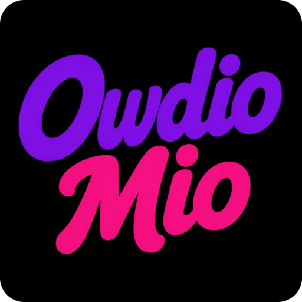

<div align="center">

  

  # Owdio Mio

  **Privacy-First, 100% Offline Audio Transcriber, Subtitle Generator & Content Creator**

  [](LICENSE)
  [](https://www.rust-lang.org/)
  [](https://github.com/emilk/egui)
  [](https://www.kernel.org/)

</div>

---

## 📖 Overview

**Owdio Mio** is a native, privacy-focused Linux desktop application built with **Rust** and **egui**. It allows you to transcribe audio/video recordings, generate clean `.srt` subtitles, and generate YouTube & Patreon copy locally.

By orchestrating **FFmpeg** for audio extraction and containerized AI models (**Whisper** for speech-to-text and **Qwen 2.5** for summarization and copywriting) via **Podman**, Owdio Mio ensures that your media and transcripts never leave your machine.

---

## ✨ Features

- 🎙️ **Offline Audio Transcription & Executive Summaries**  
  Convert any audio or video format with FFmpeg and transcribe it locally using Whisper with real-time progress updates, logs, and optional executive summarization with Qwen 2.5 Coder.

- ⏱️ **Subtitle Creator (.srt)**  
  Generate timestamped, collision-free `.srt` subtitles with customizable line length (characters per line), minimum display gaps, and optional two-line constraints.

- 📝 **YouTube & Patreon Content Generator**  
  Upload raw transcripts or pre-existing `.srt` / `.vtt` subtitle files. Qwen will extract video chapters (with accurate `MM:SS` timestamps), SEO descriptions, and patron community posts.

- 🐳 **Containerized AI Backends (Podman)**  
  Manage local Whisper and LLM server containers directly from the app interface with built-in health checks and container lifecycle controls.

- ⚡ **Lightweight & Snappy GUI**  
  Instant startup, custom typography, and minimal memory footprint powered by `egui` and `eframe`.

- 🔒 **Zero Telemetry, 100% Air-Gapped**  
  No cloud APIs, no analytics, no subscriptions. Designed for journalists, researchers, content creators, and privacy-conscious users.

---

## 🛠️ Architecture & Workflow

```text
[ Audio / Video File ]
          │
          ▼
   [ FFmpeg Chunking ]       ──▶  16kHz Mono WAV Chunks
          │
          ▼
 [ Podman: Whisper API ]     ──▶  Timestamped Segments
          │
          ├──▶ [ Subtitle Formatter ] ──▶  Clean .srt Subtitle File
          │
          ▼
 [ Podman: Qwen 2.5 Coder ]  ──▶  Executive Summary

──────────────────────────────────────────────────────────

[ Existing .srt / .vtt File ]
          │
          ▼
   [ Transcript Parser ]     ──▶  Cleaned Text with Timestamps
          │
          ▼
 [ Podman: Qwen 2.5 Coder ]  ──▶  YouTube Chapters & Patreon Copy

```

---

## 📋 Prerequisites

Before running Owdio Mio, ensure the following tools are installed on your Linux system:

### 1. FFmpeg
Used for audio extraction and conversion:
* **openSUSE Tumbleweed:** `sudo zypper install ffmpeg`
* **Fedora:** `sudo dnf install ffmpeg`
* **Ubuntu/Debian:** `sudo apt install ffmpeg`

### 2. Podman
Used to run the containerized Whisper and LLM backends:
* **openSUSE Tumbleweed:** `sudo zypper install podman`
* **Fedora:** `sudo dnf install podman`
* **Ubuntu/Debian:** `sudo apt install podman`

### 3. Rust Toolchain (For Building from Source)
Requires Rust 1.85+ (Rust 2024 edition):
```bash
curl --proto '=https' --tlsv1.2 -sSf https://sh.rustup.rs | sh
```

## 🚀 Installation & Running

### Running in Development Mode
```bash
# Clone the repository
git clone https://github.com/rockhopper-cli/owdio_mio.git
cd owdio_mio

# Run the app
cargo run
```

### Compiling Release Binary
```bash
cargo build --release
./target/release/owdio_mio
```

---

## 📦 Packaging as an RPM (openSUSE / Fedora)

Owdio Mio includes metadata for `cargo-generate-rpm`:

```bash
# 1. Install cargo-generate-rpm
cargo install cargo-generate-rpm

# 2. Build the optimized release binary
cargo build --release

# 3. Strip symbols to reduce RPM size
strip -s target/release/owdio_mio

# 4. Generate the RPM package
cargo generate-rpm
```

The generated package will be placed in `target/generate-rpm/owdio_mio-*.rpm`. Install it using Zypper:
```bash
sudo zypper install target/generate-rpm/owdio_mio-*.rpm
```

---

## 🗂️ Project Structure

```text
owdio_mio/
├── assets/
│   ├── InclusiveSans-VariableFont_wght.ttf   # Application typography
│   ├── logo.png                              # App branding & UI logo
│   └── owdio_mio.desktop                     # Linux desktop launcher entry
├── src/
│   ├── main.rs                               # Application entrypoint & font/image loader setup
│   ├── app.rs                                # Central egui state, tab navigation & log drawer
│   ├── audio/
│   │   ├── ffmpeg.rs                         # FFmpeg audio conversion & segmentation
│   │   ├── mod.rs
│   │   └── transcriber.rs                    # Multi-chunk transcription dispatcher
│   ├── audio_pipeline.rs                     # End-to-end transcription & summary pipeline
│   ├── podman/
│   │   ├── client.rs                         # Whisper HTTP client & verbose_json parser
│   │   ├── llm_client.rs                     # Qwen/llama.cpp OpenAI-compatible chat client
│   │   └── mod.rs                            # Shared HTTP client setup & timeouts
│   ├── subtitle_pipeline.rs                  # Standalone subtitle generation pipeline
│   ├── subtitles/
│   │   ├── formatter.rs                      # Word-wrapping, gap enforcement & SRT serializer
│   │   └── mod.rs
│   ├── ui/
│   │   ├── components.rs                     # Reusable UI widgets (file picker, progress bar)
│   │   ├── config.rs                         # Settings panel, container controls & health checks
│   │   ├── content_creator.rs                # YouTube description & Patreon post generator
│   │   ├── mod.rs
│   │   ├── setup_model.rs                    # Container setup instructions & copyable commands
│   │   ├── subtitle_creator.rs               # Subtitle generator tab
│   │   └── transcription.rs                  # Audio transcription & executive summary tab
│   └── utils.rs                              # Timestamp & log formatting helpers
├── Cargo.lock
├── Cargo.toml
└── LICENSE
```

---

## 📄 License

This project is licensed under the [MIT License](LICENSE).
